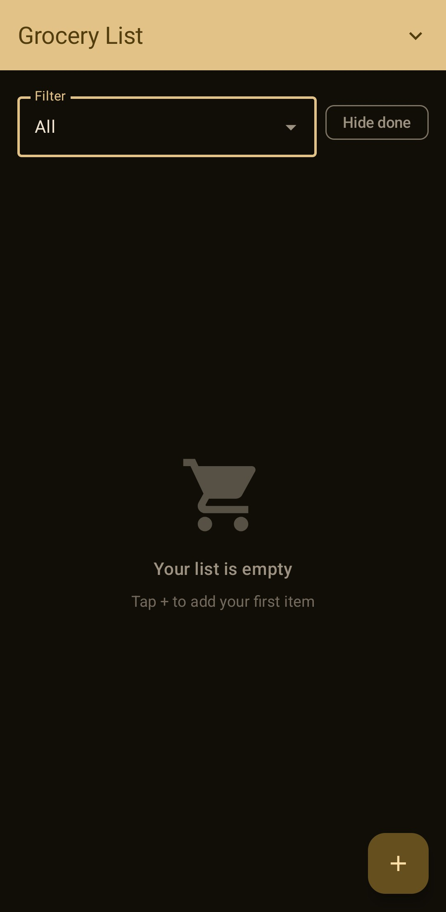
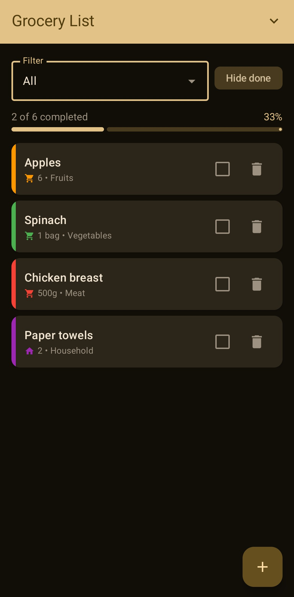
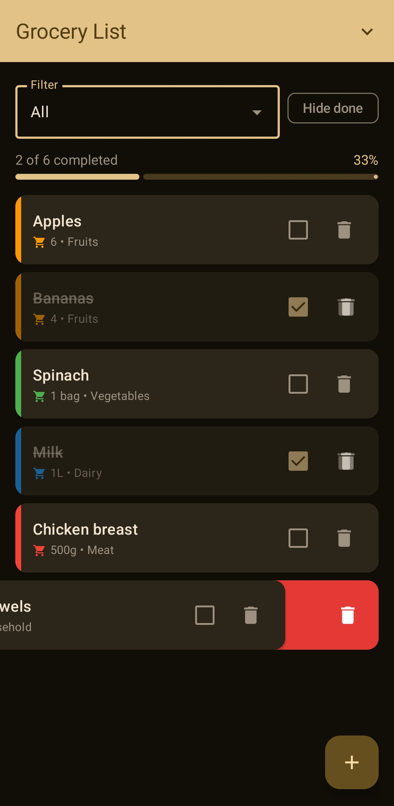
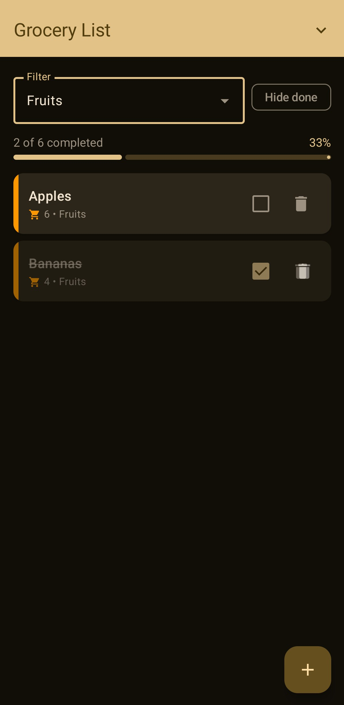
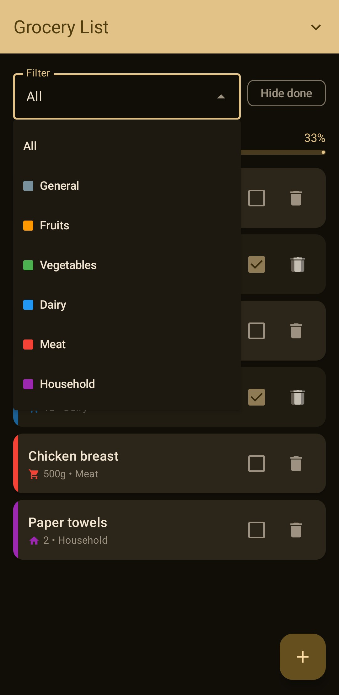
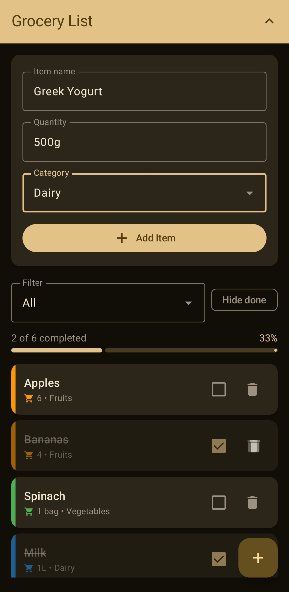

# Grocery List

A simple, fast, ad-free grocery shopping list for Android. Free and open source software, licensed under [GPL-3.0](LICENSE).

[](LICENSE)
[](#)
[](#)

## Download

[](https://play.google.com/store/apps/details?id=me.mrsofiane.simplegrocerylist)
[](https://apps.obtainium.imranr.dev/redirect?r=obtainium://add/https://github.com/mrsofiane/SimpleGroceryList)

## Features

- Multiple lists — one per store, trip, or whatever you want; tap the title to switch
- Add items with name, quantity, and category
- Built-in categories: Fruits, Vegetables, Dairy, Meat, Household, General
- Tap to mark purchased, swipe left to delete
- Edit items after adding
- Filter by category, hide completed items
- Visual progress bar (e.g. *3 of 5 completed*)
- Share/import lists as JSON — no accounts, no servers
- Material Design 3 with dynamic color (Material You)
- 100% offline, no telemetry, no ads, no tracking

## Screenshots

<p align="center">
  
  
  
</p>

<p align="center">
  
  
  
</p>

## Tech Stack

- **Language:** Kotlin
- **UI:** Jetpack Compose + Material 3
- **Architecture:** Single-activity, ViewModel + Compose state
- **Persistence:** `SharedPreferences` with Gson serialization
- **Min SDK:** 23 (Android 6.0)  •  **Target SDK:** 36
- **Build:** Gradle 9.5, AGP 8.13, Kotlin 2.0

## Build From Source

Requirements:
- JDK 17+
- Android Studio (Ladybug or newer) **or** the Android SDK + Gradle wrapper
- Android SDK platform 36

Clone and build:

```bash
git clone https://github.com/mrsofiane/SimpleGroceryList.git
cd SimpleGroceryList
./gradlew assembleDebug
```

The debug APK lands in `app/build/outputs/apk/debug/`.

To install on a connected device:

```bash
./gradlew installDebug
```

To produce a release build (you'll need your own signing config):

```bash
./gradlew assembleRelease
```

## Privacy

This app does not collect, transmit, or share any data. Everything stays on your device. The only network code in this repo is… none. The share feature exports a JSON file that you choose where to send.

## Contributing

Contributions are welcome — see [CONTRIBUTING.md](CONTRIBUTING.md) for how to file issues and submit PRs.

## License

This project is licensed under the **GNU General Public License v3.0**. See [LICENSE](LICENSE) for the full text.

> In short: you are free to use, study, modify, and distribute this software, as long as derivative works are also released under GPL-3.0.

## Author

**Sofiane Louchene** — [github.com/mrsofiane](https://github.com/mrsofiane)
